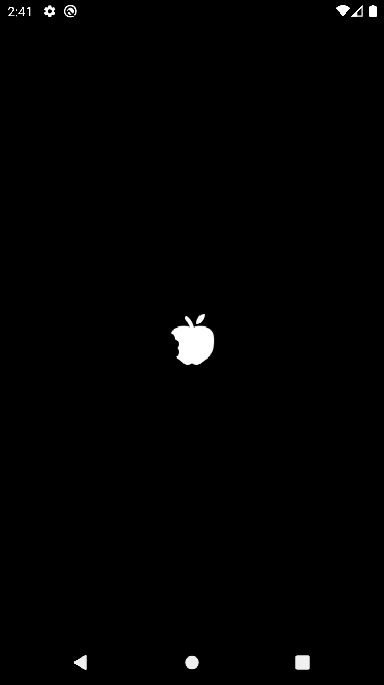
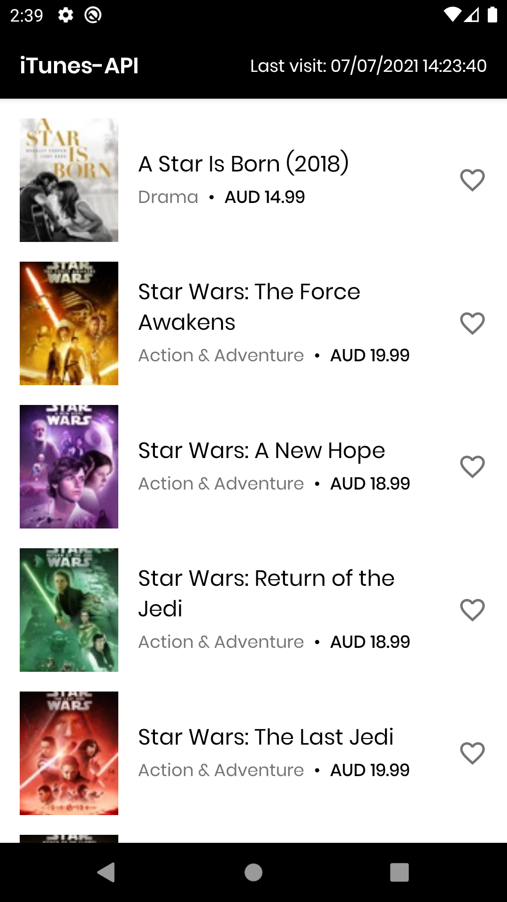
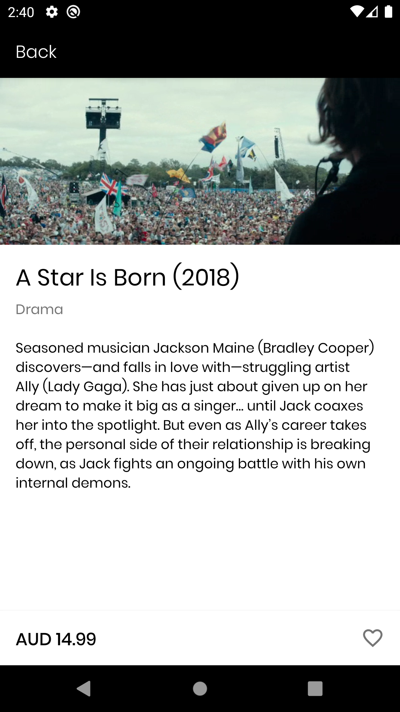

# iTunes-API

<!-- ABOUT THE PROJECT -->
  

## About The Project

This application gets data from the iTunes Search API using retrofit library for server requests. The data retrieved is then displayed with a recyclerview showing the following data: Track Name, Artwork, Price, Genre. The application also allows the user to click on an item in the list to display more information about the media item such as preview and long description. The application was created with an MVVM(model view viewmodel) architecture as it is the officially supported architecture by google and it produces a much cleaner and optimized codebase. Dagger-hilt was also used for dependency injection to reduce boilerplate code and prepare the application for future testing. Room database was also added to the project to store the instances that the user opened the application and iTunesMedia that the user added to favorites.

### Built With

This project is built with:
* [Android Studio](https://developer.android.com/studio)
* [Kotlin](https://kotlinlang.org)

Here are libraries used for this project:
* [Material Design](https://material.io/develop/android)
* [MVVM Architecture](https://developer.android.com/jetpack/guide)
* [Coroutines](https://developer.android.com/kotlin/coroutines)
* [Retrofit](https://square.github.io/retrofit/)
* [Dagger-Hilt](https://dagger.dev/hilt/)
* [Glide](https://github.com/bumptech/glide)
* [Android Navigation Components](https://developer.android.com/guide/navigation/navigation-getting-started)
* [Room](https://developer.android.com/training/data-storage/room)

### UI/UX Design

#### UI and UX design were created using Figma
https://www.figma.com/file/PbKSlo7Ch0hl6jqKV5lMfB/iTunes-API?node-id=0%3A1
